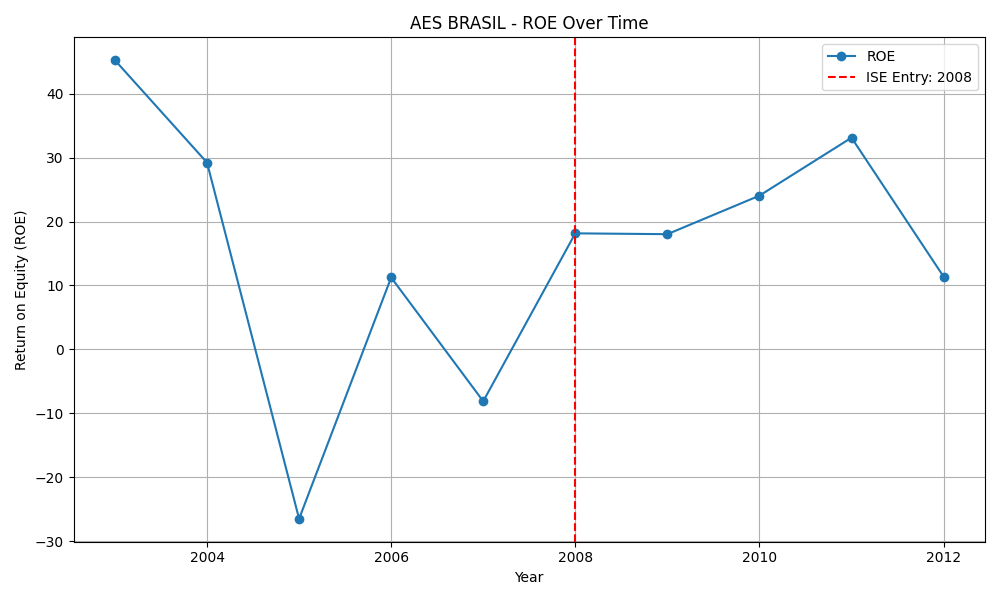
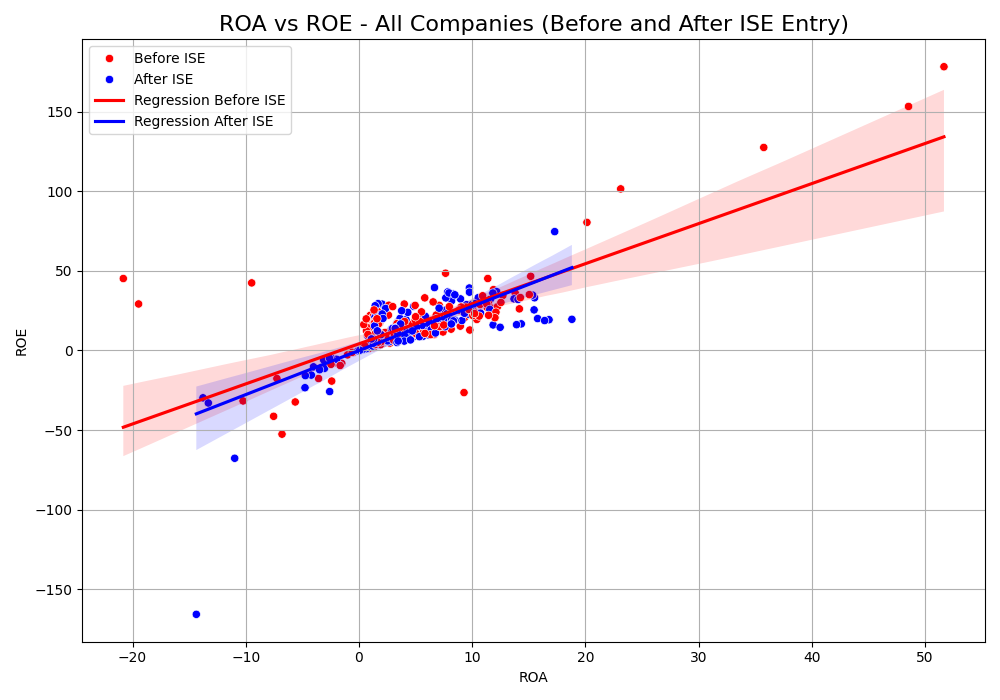
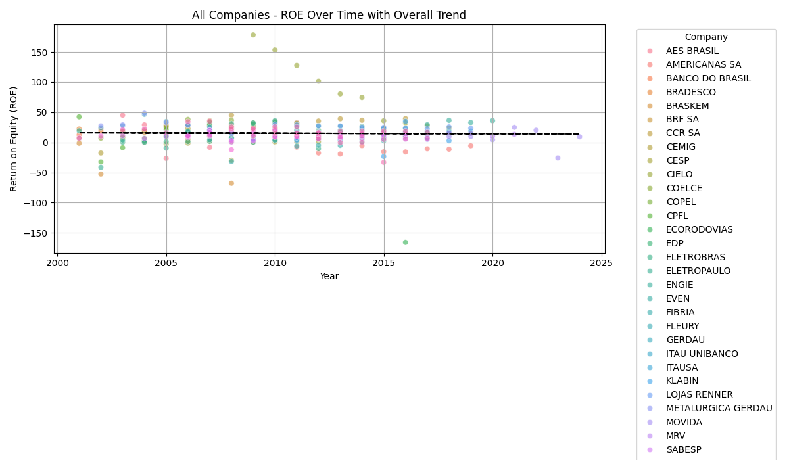
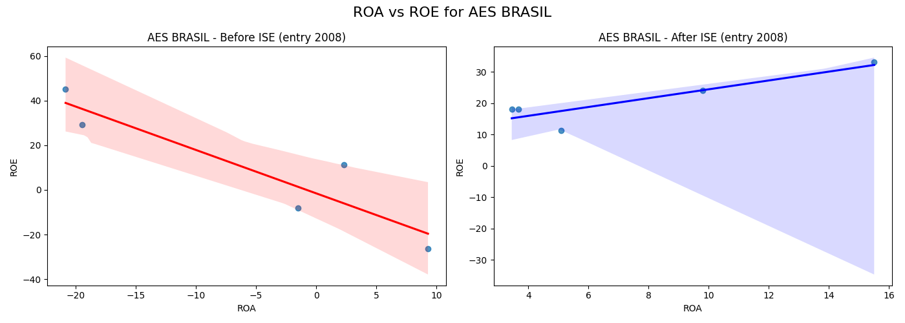

# tcc_ISE

## Análise do Impacto da Entrada no Índice de Sustentabilidade Empresarial (ISE)

Este projeto investiga a relação entre a adesão de empresas ao Índice de Sustentabilidade Empresarial (ISE) da B3 (Brasil, Bolsa, Balcão) e potenciais mudanças em seus indicadores financeiros chave: Retorno sobre o Patrimônio Líquido (ROE) e Retorno sobre o Ativo (ROA). Através da visualização e análise de tendências, buscamos identificar possíveis efeitos decorrentes da entrada no índice.

### Estrutura Detalhada do Projeto

O projeto está organizado para facilitar uma análise comparativa e aprofundada:

* `charts/`: Armazena um gráfico combinado (`All_Companies_ROA_ROE_ISE.png`) que relaciona ROA e ROE para todas as empresas, utilizando cores ou marcadores para distinguir os períodos antes e depois da entrada no ISE. Adicionalmente, armazena gráficos individuais (`*_ROA_ROE_ISE.png`) para cada empresa, focados na evolução da relação ROA/ROE ao longo do tempo e na marcação da entrada no ISE.
* `combined_companies.py`: Script Python responsável por gerar o gráfico combinado de ROA versus ROE para todas as empresas, com diferenciação visual dos dados pré e pós-entrada no ISE.
* `combined_indicator_vs_year_with_regression/`: Inclui gráficos que agregam os dados de todas as empresas para visualizar as tendências gerais do ROA (`all_companies_roa_vs_year_with_overall_regression.png`) e do ROE (`all_companies_roe_vs_year_with_overall_regression.png`) ao longo dos anos, com a sobreposição de uma linha de regressão linear geral para identificar tendências macro.
* `data.csv`: Arquivo CSV fundamental que contém os dados financeiros e de entrada no ISE para as empresas analisadas. As colunas típicas incluem: `company_id`, `year`, `ROE`, `ROA`, `ise_entry` e, opcionalmente, `already_on_ise`.
* `indicator_vs_year/`: Contém subdiretórios nomeados para cada empresa, cada um armazenando gráficos (`roa_vs_year_with_entry.png` e `roe_vs_year_with_entry.png`) que ilustram a evolução temporal do ROA e do ROE, respectivamente, com uma linha vertical destacando o ano de entrada no ISE para cada empresa.
* `indicator_vs_year_with_regression/`: Similar ao diretório `indicator_vs_year/`, mas com a adição de uma linha de regressão linear para cada indicador (ROE e ROA) ao longo do tempo para cada empresa, facilitando a identificação de tendências individuais.
* `main.py`: (*Adicione aqui uma breve descrição da função principal deste script, se souber. Exemplo: "Script principal para carregar os dados e orquestrar a geração dos gráficos."*).
* `charts.py`: Script Python encarregado de gerar os gráficos individuais para cada empresa, com foco na relação entre ROA e ROE e como essa relação pode se comportar em torno do ano de entrada no ISE. Os gráficos resultantes são salvos no diretório `charts/`.
* `requeriments.txt`: Arquivo de texto listando as bibliotecas Python essenciais para a execução dos scripts, como `pandas` para manipulação e análise de dados tabulares e `matplotlib` para a criação de visualizações gráficas.

### Insights e Resultados Potenciais

A estrutura do projeto foi concebida para gerar diversos insights relevantes:

* **Análise da Trajetória Individual das Empresas:** Os gráficos presentes em `indicator_vs_year/` e `indicator_vs_year_with_regression/` possibilitam examinar a evolução do ROE e do ROA para cada empresa ao longo do tempo. A marcação do ano de entrada no ISE facilita a identificação visual de potenciais mudanças nas tendências ou nos níveis desses indicadores após a adesão ao índice. A inclusão da regressão linear auxilia na quantificação da tendência geral para cada empresa.

    
    *Exemplo de gráfico mostrando a evolução do ROE de uma empresa ao longo dos anos, com uma linha vertical indicando o ano de entrada no ISE.*

* **Compreensão da Relação ROA-ROE:** Os gráficos em `charts/`, especialmente o consolidado (`All_Companies_ROA_ROE_ISE.png`) e os individuais, exploram a dinâmica entre a eficiência na utilização dos ativos (ROA) e a rentabilidade para os acionistas (ROE). Analisar como essa relação se modifica antes e depois da entrada no ISE pode fornecer pistas sobre alterações na estrutura financeira ou operacional das empresas.

    
    *Exemplo de gráfico combinando os dados de ROA e ROE de todas as empresas, com pontos codificados para distinguir períodos pré e pós-ISE.*

* **Identificação de Tendências Agregadas:** Os gráficos armazenados em `combined_indicator_vs_year_with_regression/` oferecem uma perspectiva geral das tendências do ROE e do ROA para o conjunto de empresas analisadas. A linha de regressão linear geral busca identificar padrões comuns de comportamento desses indicadores ao longo do tempo, independentemente do status de participação no ISE.

    
    *Exemplo de gráfico mostrando a tendência geral do ROE para todas as empresas ao longo do tempo, com uma linha de regressão linear sobreposta.*

* **Comparativo Pré e Pós-Adesão ao ISE:** O gráfico gerado por `combined_companies.py`, juntamente com os gráficos individuais em `charts/`, possibilita a comparação direta dos dados de ROA e ROE antes e depois do ano de entrada no ISE, com o objetivo de detectar mudanças sistemáticas nos indicadores associadas à adesão ao índice.

    
    *Exemplo de gráfico individual de ROA vs ROE para uma empresa, potencialmente com pontos diferenciados para períodos antes e depois da entrada no ISE.*

### Próximos Passos e Considerações para Análise

* **Interpretação Visual Detalhada:** Examine atentamente os gráficos gerados em todos os diretórios. Procure por descontinuidades, mudanças na inclinação das linhas de tendência (nos gráficos com regressão) ou deslocamentos nos agrupamentos de pontos (no gráfico combinado ROA/ROE) que coincidam com o ano de entrada no ISE.
* **Validação Estatística:** Complemente a análise visual com testes estatísticos rigorosos. A aplicação de testes de diferença de médias (como o teste t de Student) ou a análise de regressão segmentada podem ajudar a verificar a significância estatística de quaisquer mudanças observadas nos indicadores antes e depois da entrada no ISE.
* **Análise da Persistência dos Efeitos:** Considere a duração da permanência de uma empresa no ISE como uma variável relevante. Investigue se os potenciais efeitos da entrada são de curto ou longo prazo, e se eles se intensificam ou se atenuam com o tempo de adesão.
* **Controle por Outras Variáveis:** Reconheça que o desempenho financeiro é influenciado por diversos fatores. Em análises futuras, considere incorporar outras variáveis relevantes (como o setor de atuação da empresa, seu tamanho, e as condições macroeconômicas) para tentar isolar de forma mais precisa o efeito específico da entrada no ISE.
* **Distinção entre Correlação e Causalidade:** É fundamental lembrar que as visualizações gráficas e as análises de regressão podem identificar correlações, mas não estabelecem relações de causalidade. Seja cauteloso ao inferir que a entrada no ISE é a causa direta de quaisquer mudanças observadas nos indicadores financeiros.

A estrutura deste projeto fornece uma base sólida para investigar o impacto da entrada no ISE. A análise criteriosa dos resultados visuais e a aplicação de métodos estatísticos adequados são cruciais para obter insights significativos e robustos sobre esse estudo de caso.